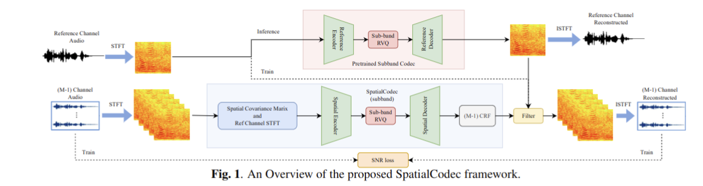

# SpatialCodec: Neural Spatial Speech Coding
This is the inference models of our paper SpatialCodec: Neural Spatial Speech Coding: https://arxiv.org/abs/2309.07432. Our demo site is shown here: https://xzwy.github.io/SpatialCodecDemo/.


## General Pipeline
<p align="center">

</p> 

##  Inference SpatialCodec + Sub-band Codec
```python 
python ./SpatialCodec/mimo_inference.py --input_dir $input_dir --ref_ckpt_dir $ref_ckpt_dir --spatial_ckpt_dir $spatial_ckpt_dir --output_dir $output_dir
```

##  Inference MIMO E2E
```python
python ./MIMO_SPATIAL_CODEC/mimo_inference.py --input_dir $input_dir --ckpt_dir $ckpt_dir --output_dir $output_dir
```

## Checkpoints
The checkpoints can be accessed here: https://drive.google.com/drive/folders/1iHVpJj8HieIOAZYCUyYFihuFxeCara1u?usp=sharing


## Citations
If you use our **SpatialCodec** for your research, please consider citing

```
@misc{xu2023spatialcodec,
      title={SpatialCodec: Neural Spatial Speech Coding}, 
      author={Zhongweiyang Xu and Yong Xu and Vinay Kothapally and Heming Wang and Muqiao Yang and Dong Yu},
      year={2023},
      eprint={2309.07432},
      archivePrefix={arXiv},
      primaryClass={cs.SD}
}
```